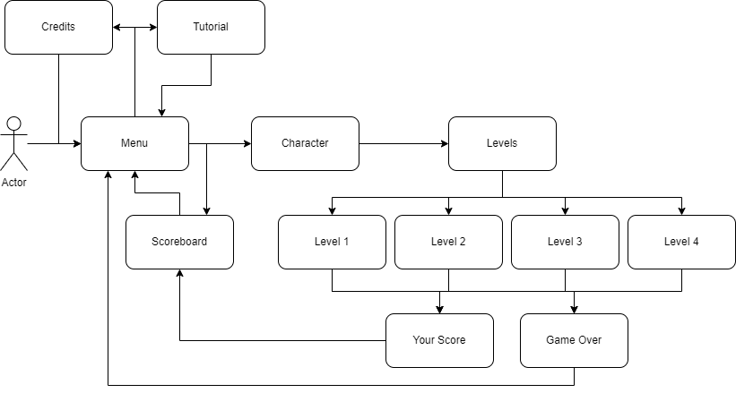

# `<4Estações>`

* Link do jogo: [https://4estacoes.vercel.app/](https://4estacoes.vercel.app/)

## Motivação

A motivação desse projeto é desenvolver um jogo para a disciplina de Estágio Supervisionado 1 da Uni7.

## Objetivo

O objetivo do jogo é conseguir aumentar seu número de score, que é obtido quando se aperta o comando correto no tempo correto (que será ditado pelo ritmo da música).

## Valor Agregado

Aprender na prática a realização de todo um ciclo de um projeto. Desde sua concepção, desenvolvimento, testes e entrega.

## Fases

Serão 4 fases que aumentarão o nível de dificuldade pela quantidade de comandos a serem executados e na velocidade que eles aparecem. O jogador pode escolher qual fase jogar sem precisar ter passado pelas anteriores.

| Fases | Descrição |
| ----- | ----------- |
| 1     | A primeira fase do jogo se passará em um ambiente de primavera, com a música [TBD], e terá a velocidade de descida dos comandos igual a 1. |
| 2     | A segunda fase do jogo se passará em um ambiente de verão, com a música [TBD], e terá a velocidade de descida dos comandos igual a 2. |
| 3     | A terceira fase do jogo se passará em um ambiente de outono, com a música [TBD], e terá a velocidade de descida dos comandos igual a 3. |
| 4     | A quarta fase do jogo se passará em um ambiente de inverno, com a música [TBD], e terá a velocidade de descida dos comandos igual a 4. |

## Esquema de Pontuação

Em cada fase o jogador receberá um score à medida que acertar uma maior quantidade de comandos com a melhor precisão. No entanto, se errar uma quantidade de comandos considerável, será eliminado da fase.

| Precisão | Score |
| ----- | ----------- |
| Entre 90% e 100% | 10 pts |
| Entre 50% e 89%     | 5 pts |
| Abaixo de 50%      | 0 pts |

Para ser eliminado, o jogador deve errar 50% dos elementos.
Chega-se ao fim da fase quando acabar a música. O score será contabilizado então.

## Requisitos

### Épicos/Funcionalidades

1. `Menu Inicial`
   Tutorial;
   Iniciar;
   Placar geral;
   Créditos
2. `Seleção de Personagem`
   Personagem 1: Sandy;
   Personagem 2: Junior;
3. `Seleção da fase`
   Fase Primavera;
   Fase Verão;
   Fase Outono;
   Fase Inverno;
4. `Placar geral`
   TOP 10 jogagores com maior score: Nome do jogador (3 letras - Fase jogada);
5. `Créditos`
   Créditos;
6. `Fases`
   Cenário de cada fase;
   Elementos de comando;
   Músicas [TBD];
   Personagem tocando;

### Personas

1. **`<Jogador#1>`** - `<Irá selecionar o personagem Sandy e jogar o jogo.>`.
2. **`<Jogador#2>`** - `<Irá selecionar o personagem Junior e jogar o jogo.>`.

## Protótipos de Tela



## Instalação

Valide se tem [Node.js](https://nodejs.org) instalado.

Clone esse repositório e entre na pasta

```
npm i
```

### Rode o development server

```
npm start
```

Para visualizar localmente: http://localhost:8080/.

### Crie uma production build

```
npm run build
```